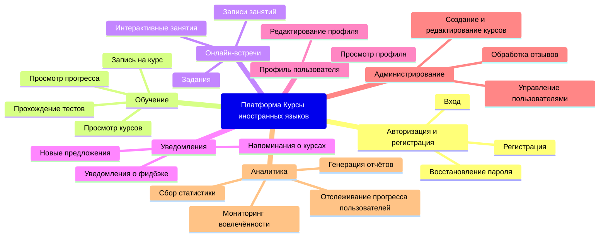
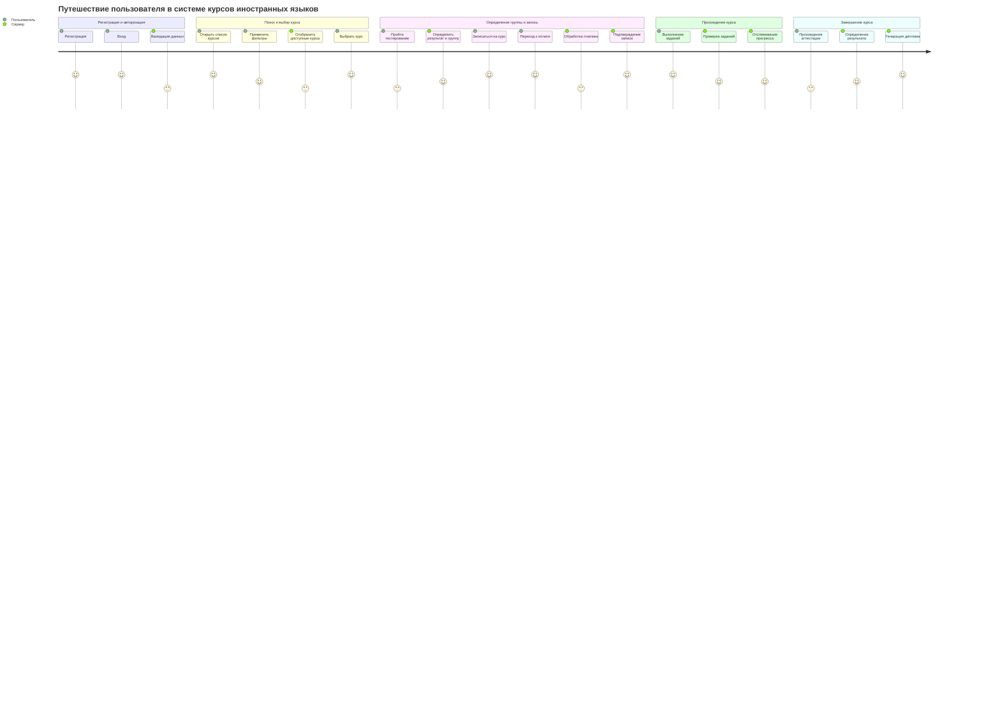
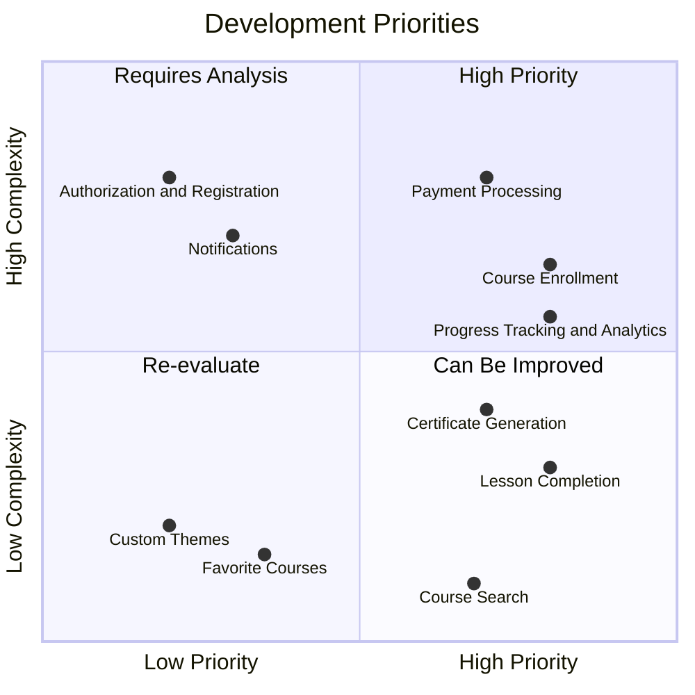
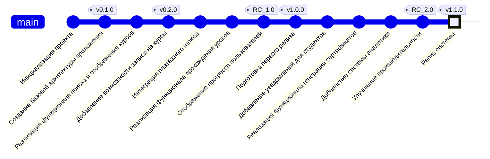

### Практическая №12 по дисциплине "Проектирование клиент-серверных систем"

**Клиент-серверная система 'Курсы иностранных языков'**

Представляет сосбой платформу для обучения иностранным языкам. Пользователь (студент) может выбрать интересующий курс, пройти тестирование, которое определит его уровень. Далее система подберёт для него подходящую по уровню группу. 

Преподавателям доступен функционал по управлению курсами и проведению онлайн-занятий.

**Диаграмма структуры функциональных возможностей (mindmap)**

На диаграмме представлены основные функции системы.

**Диаграмма путешествия пользователя (user jorney)**

Диаграмма описывает состояние пользователя при взаимодействии с системой, с разными её частями и функциями.

**Диаграмма квадрант-граф**

Диаграмма описывает важность разработки тех или иных функций на основе приоритета и сложности реализации.

**Диаграмма git graph**

Описывает дерево коммитов (пример) в удобном формате.